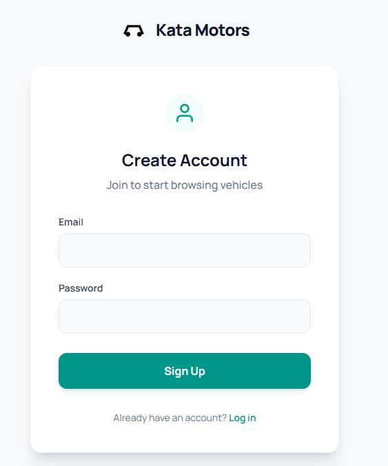
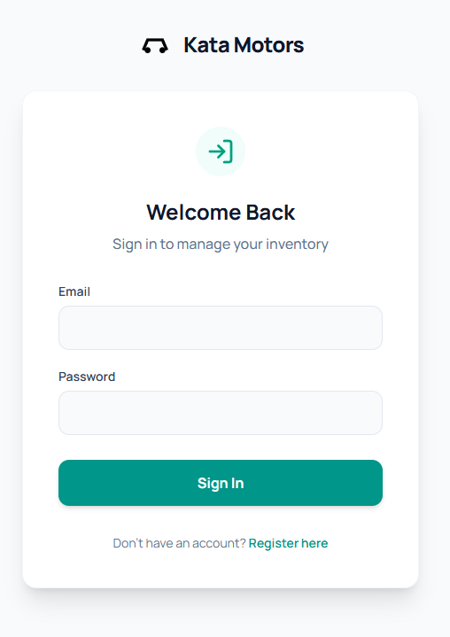
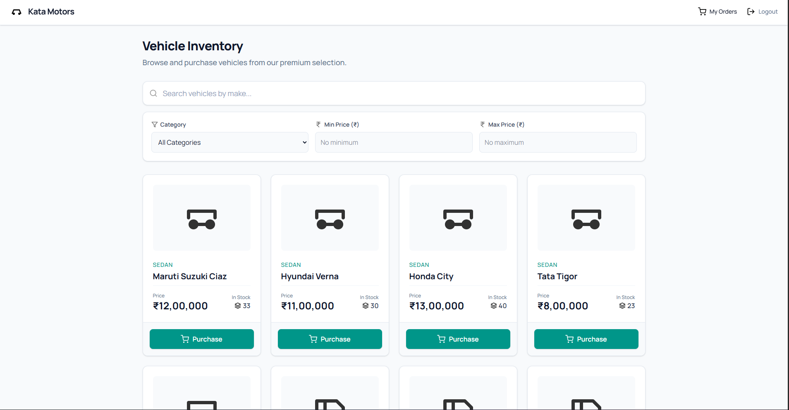
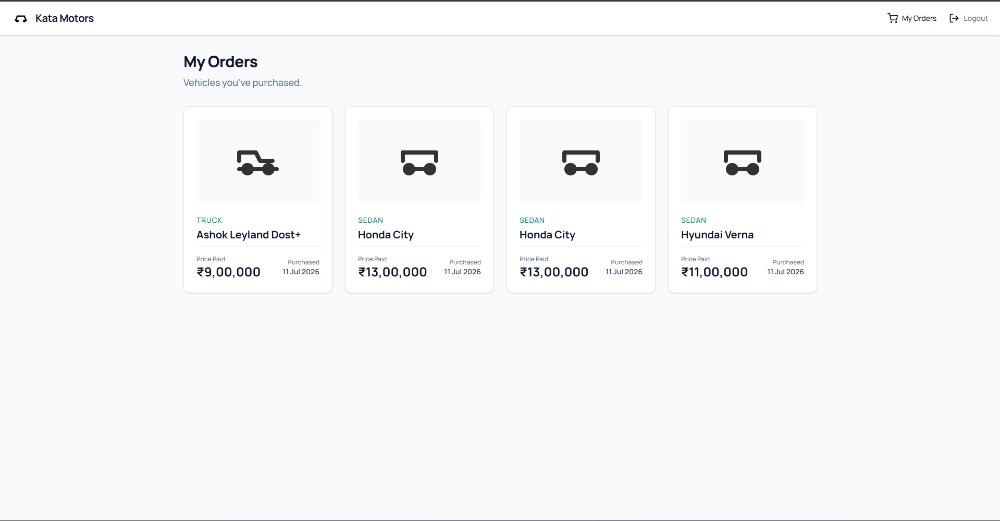
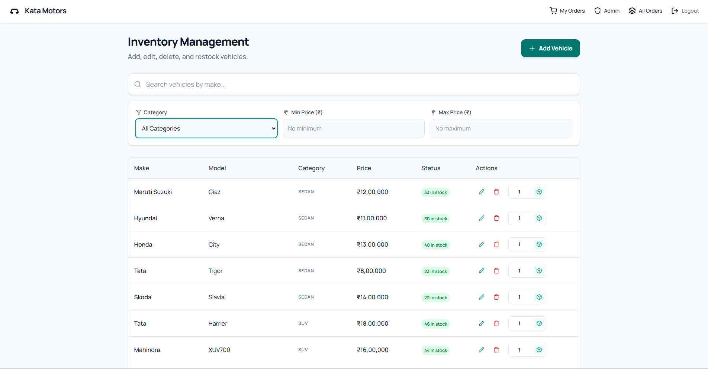
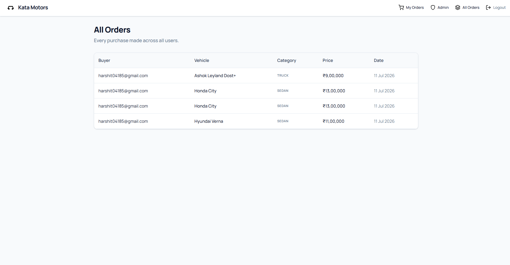

# Kata Car Dealership

A full-stack Car Dealership Inventory System built with **FastAPI + React + MongoDB** (FARM stack). It supports user/admin authentication with JWT, full vehicle CRUD, search & filtering, purchase/restock inventory flows, and an order history for both customers and admins.

The project was built test-first (TDD, Red → Green → Refactor) with a fully documented, transparent AI-assisted workflow — see [My AI Usage](#my-ai-usage) below.

**Repository:** https://github.com/HM18042005/Kata-Car-Dealership
**Live Demo:** https://kata-car-dealership.vercel.app

Demo admin login (view/manage inventory, restock, see all orders):
```
Email:    kata@dealership.com
Password: s2FPCraI0nf2XU
```
The live demo is seeded with 40 sample vehicles across all 8 categories. Registering a new account signs you in as a regular customer.

---

## Table of Contents

- [Features](#features)
- [Tech Stack](#tech-stack)
- [Project Structure](#project-structure)
- [Getting Started](#getting-started)
  - [Prerequisites](#prerequisites)
  - [Quick Start (Windows, one command)](#quick-start-windows-one-command)
  - [Manual Setup — Backend](#manual-setup--backend)
  - [Manual Setup — Frontend](#manual-setup--frontend)
- [Environment Variables](#environment-variables)
- [Seeding Data](#seeding-data)
- [API Overview](#api-overview)
- [Screenshots](#screenshots)
- [Testing](#testing)
- [Test Report](#test-report)
- [My AI Usage](#my-ai-usage)

---

## Features

- **Authentication** — register/login with JWT bearer tokens; passwords hashed with bcrypt, never stored or returned in plaintext.
- **Role-based access** — regular `user` accounts and a seeded `admin` account; admin-only actions (delete, restock, view all orders) are enforced server-side.
- **Vehicle inventory** — add, list, update, delete vehicles; each vehicle has a make, model, category (8 types: sedan, suv, hatchback, truck, coupe, convertible, van, electric), price (₹), and quantity in stock.
- **Search & filter** — filter by make, model, category, and price range (min/max), all combinable.
- **Purchase flow** — customers purchase one unit at a time; quantity is decremented atomically, and out-of-stock vehicles are blocked with a clear error.
- **Restock flow** — admins can restock any vehicle by a given amount.
- **Order history** — every purchase creates an order record; customers see "My Orders", admins see "All Orders" across every user.
- **Currency** — all prices are displayed in Indian Rupees (₹), matching the target market.
- **Responsive UI** — built with Tailwind CSS, accessible components (labelled inputs, focus states, keyboard-navigable modals).

## Tech Stack

| Layer | Technology |
|---|---|
| Backend | FastAPI (Python), synchronous PyMongo |
| Database | MongoDB |
| Auth | JWT (PyJWT) + bcrypt password hashing |
| Frontend | React 18 + Vite |
| Styling | Tailwind CSS v4 |
| Routing | React Router v6 |
| Backend testing | pytest + FastAPI `TestClient` |
| Frontend testing | Vitest + React Testing Library |

## Project Structure

```
Kata-Car-Dealership/
├── backend/
│   ├── app/
│   │   ├── main.py            # FastAPI app, CORS, router mounting
│   │   ├── routers/           # auth.py, vehicles.py, orders.py — HTTP layer only
│   │   ├── services/          # business logic, no FastAPI imports
│   │   ├── models.py          # Pydantic request/response models
│   │   ├── db.py               # PyMongo client + collection accessors
│   │   ├── security.py         # bcrypt hash/verify, JWT, auth dependencies
│   │   ├── seed_admin.py       # python -m app.seed_admin
│   │   └── seed_vehicles.py    # python -m app.seed_vehicles
│   └── tests/                  # pytest suite
├── frontend/
│   ├── src/
│   │   ├── pages/               # Dashboard, Orders, Admin, AdminOrders, Login, Register
│   │   ├── components/          # VehicleCard, VehicleTable, VehicleForm, OrderCard, ...
│   │   └── hooks/               # useApi, etc.
│   └── tests/                   # Vitest + RTL suite
├── docs/                        # architecture, API, database, security specs
├── images/                      # README screenshots
├── run.ps1                      # one-command dev runner (Windows)
└── README.md
```

## Getting Started

### Prerequisites

- **Python** 3.11+ (tested on 3.14)
- **Node.js** 18+ and npm
- **MongoDB** running locally on `mongodb://localhost:27017` (or a reachable connection string)

### Quick Start (Windows, one command)

A PowerShell script automates the entire local setup — virtualenv, dependencies, `.env` generation, admin seeding, and launching both servers:

```powershell
.\run.ps1
```

This will:
1. Verify `python`, `node`, `npm` are on PATH and check MongoDB is reachable.
2. Create `backend/.venv`, install backend requirements, generate `backend/.env` (with a random `SECRET_KEY` and a dev admin password) if one doesn't already exist.
3. Seed the admin user (idempotent — safe to re-run).
4. Install frontend npm dependencies.
5. Launch the backend (`http://localhost:8000`, Swagger docs at `/docs`) and the frontend (`http://localhost:5173`), each in its own terminal window.

Useful flags:
```powershell
.\run.ps1 -SkipInstall   # skip pip/npm install, fast restart
.\run.ps1 -SkipSeed      # skip admin seeding
```

### Manual Setup — Backend

```bash
cd backend
python -m venv .venv

# Windows
.venv\Scripts\activate
# macOS/Linux
source .venv/bin/activate

pip install -r requirements.txt

# Create your .env from the example and fill in real values
cp .env.example .env   # Windows: copy .env.example .env
```

Edit `backend/.env`:
```env
SECRET_KEY=<generate a long random string>
ADMIN_EMAIL=admin@example.com
ADMIN_PASSWORD=<a strong password>
MONGO_URI=mongodb://localhost:27017
```

Seed the first admin user (idempotent, safe to re-run):
```bash
python -m app.seed_admin
```

Optionally seed sample inventory (40 vehicles, 5 brands × 8 categories, prices in ₹):
```bash
python -m app.seed_vehicles
```

Run the API:
```bash
uvicorn app.main:app --reload --port 8000
```

The API is now available at `http://localhost:8000`, with interactive Swagger docs at `http://localhost:8000/docs`.

### Manual Setup — Frontend

```bash
cd frontend
npm install
npm run dev
```

The app is now available at `http://localhost:5173`.

> The frontend expects the backend at `http://localhost:8000` and the backend's CORS allowlist includes `http://localhost:5173` by default (see `app/main.py`; add a `CORS_ORIGIN` env var for a deployed frontend origin).

## Environment Variables

Defined in `backend/.env` (see `backend/.env.example`):

| Variable | Description |
|---|---|
| `SECRET_KEY` | Secret used to sign JWTs (HS256). Must be a real secret, not `change-me`. |
| `ADMIN_EMAIL` | Email for the seeded first admin account. |
| `ADMIN_PASSWORD` | Password for the seeded first admin account. |
| `MONGO_URI` | MongoDB connection string. |
| `CORS_ORIGIN` *(optional)* | Additional allowed origin for a deployed frontend. |

`.env` is gitignored — never commit real secrets. Only `.env.example` (with placeholder values) is tracked.

## Seeding Data

| Script | Purpose | Command |
|---|---|---|
| `app.seed_admin` | Creates the first `admin` user from `ADMIN_EMAIL`/`ADMIN_PASSWORD`. Idempotent. | `python -m app.seed_admin` |
| `app.seed_vehicles` | Seeds 40 sample vehicles (5 Indian-market brands per each of the 8 categories) with random stock (10–50 units) and prices in ₹. Skips if vehicles already exist. | `python -m app.seed_vehicles` |

## API Overview

Base path: `/api`. Protected routes require `Authorization: Bearer <jwt>`. Full contract, request/response shapes, and error codes are documented in [`docs/backend/api.md`](docs/backend/api.md).

| Method | Path | Auth | Description |
|---|---|---|---|
| POST | `/api/auth/register` | none | Register a new user (always created with role `user`) |
| POST | `/api/auth/login` | none | Log in, returns a JWT bearer token |
| POST | `/api/vehicles` | user | Add a vehicle |
| GET | `/api/vehicles` | user | List all vehicles |
| GET | `/api/vehicles/search` | user | Search by make, model, category, price range |
| PUT | `/api/vehicles/{id}` | user | Update a vehicle |
| DELETE | `/api/vehicles/{id}` | admin | Delete a vehicle |
| POST | `/api/vehicles/{id}/purchase` | user | Purchase one unit (decrements stock, creates an order) |
| POST | `/api/vehicles/{id}/restock` | admin | Increase stock by a given amount |
| GET | `/api/orders` | user | List the caller's own order history |
| GET | `/api/orders/all` | admin | List every order across all users |

## Screenshots

### Sign Up
New users register with an email and password. All accounts are created with the `user` role by default.



### Sign In
Existing users log in and receive a JWT used for all subsequent protected requests.



### User Dashboard
Customers browse all available vehicles, search/filter by make, model, category, and price (₹), and purchase a vehicle directly from its card.



### My Orders
Customers can review their own purchase history.



### Admin — Inventory Management
Admins can add, update, delete, and restock vehicles from a dedicated management view.



### Admin — All Orders
Admins can view every order placed across all customers.



## Testing

**Backend** (pytest, real MongoDB test database — no mocking):
```bash
cd backend
.venv\Scripts\activate    # or: source .venv/bin/activate
pytest -v
```

**Frontend** (Vitest + React Testing Library):
```bash
cd frontend
npm test
```

## Test Report

Both suites were run in full immediately before this README was finalized.

### Backend — pytest

```
58 passed in 18.03s
```

| File | Tests | Result |
|---|---|---|
| `tests/test_auth.py` | 12 | ✅ all passing |
| `tests/test_vehicles.py` | 24 | ✅ all passing |
| `tests/test_inventory.py` | 11 | ✅ all passing |
| `tests/test_orders.py` | 6 | ✅ all passing |
| `tests/test_security.py` | 5 | ✅ all passing |
| **Total** | **58** | **✅ 58/58 passing** |

Coverage includes: registration/login rules (duplicate email, bcrypt hashing, forced `user` role, identical 401 messages), vehicle CRUD with validation (`422`) and auth (`401`/`403`), search filters (category, case-insensitive make, price range), purchase/restock stock rules (`404`/`409`/`422`), order creation and per-user/all-order listing, and low-level security unit tests (hash/verify, JWT round-trip, malformed token rejection).

### Frontend — Vitest

```
Test Files  18 passed (18)
     Tests  53 passed (53)
```

| File | Tests | Result |
|---|---|---|
| `Admin.test.jsx` | 5 | ✅ |
| `AdminOrders.test.jsx` | 1 | ✅ |
| `AuthContext.test.jsx` | 3 | ✅ |
| `buildQueryString.test.js` | 4 | ✅ |
| `ConfirmPurchaseModal.test.jsx` | 5 | ✅ |
| `Dashboard.test.jsx` | 4 | ✅ |
| `Login.test.jsx` | 1 | ✅ |
| `Modal.test.jsx` | 5 | ✅ |
| `OrderCard.test.jsx` | 1 | ✅ |
| `Orders.test.jsx` | 2 | ✅ |
| `OrderTable.test.jsx` | 2 | ✅ |
| `Register.test.jsx` | 1 | ✅ |
| `RequireAdmin.test.jsx` | 2 | ✅ |
| `RequireAuth.test.jsx` | 1 | ✅ |
| `useApi.test.jsx` | 6 | ✅ |
| `VehicleCard.test.jsx` | 2 | ✅ |
| `VehicleForm.test.jsx` | 2 | ✅ |
| `VehicleTable.test.jsx` | 6 | ✅ |
| **Total** | **53** | **✅ 53/53 passing** |

> Some `useApi`/router tests emit React `act(...)` warnings from a third-party async-state edge case; these are non-fatal console warnings, not failures — every test still passes.

**Total across both suites: 111/111 tests passing.**

## My AI Usage

Transparency on AI involvement in this project, as required by the assessment brief.

### Which AI tools were used

- **Kiro** (AI coding assistant, built on Claude models) — used throughout backend and frontend implementation, test writing, debugging, and documentation (including this README).

### How each tool was used

- **Planning and requirements capture** — before any code was written, the project brief was organized into a local context file (`context.md`, gitignored) so that the TDD workflow, required endpoints, and deliverables were explicit and agreed upon up front.
- **Test-first development (Red → Green → Refactor)** — for each backend feature slice (auth, vehicles, inventory, orders), a failing test was written first against the documented API/service contract in `docs/backend/`, then the minimal implementation was written to make it pass, then refactored while keeping tests green. This produced the visible Red-Green-Refactor history in the pytest suite.
- **Backend implementation** — FastAPI routers, PyMongo-backed services, Pydantic models, JWT/bcrypt security helpers, and the strict routers→services→db.py layering were all written with AI assistance, verified against the specs in `docs/backend/architecture.md`, `docs/backend/security.md`, and `docs/backend/services.md`.
- **Frontend implementation** — React components (VehicleCard, VehicleTable, VehicleForm, OrderCard/OrderTable, Admin/AdminOrders pages), Tailwind styling, and the `useApi` data-fetching hook were built with AI assistance and covered by Vitest + React Testing Library tests.
- **Bug fixing and edits** — every AI-generated change was reviewed, and follow-up fixes (e.g., correcting currency formatting, replacing the dollar icon with a rupee icon, writing the seed scripts) were requested, reviewed, and verified by running the actual test suite and seed scripts rather than trusting output blindly.
- **Documentation** — API/architecture/security/database specs under `docs/`, and this README (setup instructions, screenshots, test report), were drafted with AI assistance and cross-checked against the actual source code and live test output rather than written from memory.

### How AI affected the workflow, and a personal reflection

Using an AI assistant sped up the mechanical parts of TDD — scaffolding a new router, writing the corresponding test file, wiring a Pydantic model — while leaving the decisions that matter (API contract shape, validation rules, which layer owns which responsibility, currency/locale choices) explicit and reviewed at every step. Every generated change was verified by actually running `pytest`/`vitest` before being accepted, and nothing was merged from a "looks right" guess. The biggest benefit was consistency: because the specs in `docs/backend/` were written down first, the AI could be held to the same contract across auth, vehicles, inventory, and orders, which kept the codebase's layering (routers never touch PyMongo, services never import FastAPI) honest throughout the project. The tradeoff is that AI-assisted code still needs a human to catch domain-specific details it won't infer on its own — for example, defaulting to USD (`$`) formatting until explicitly corrected to INR (`₹`) for the Indian market — which is why every screen and currency-facing component was manually reviewed before this README was finalized.
